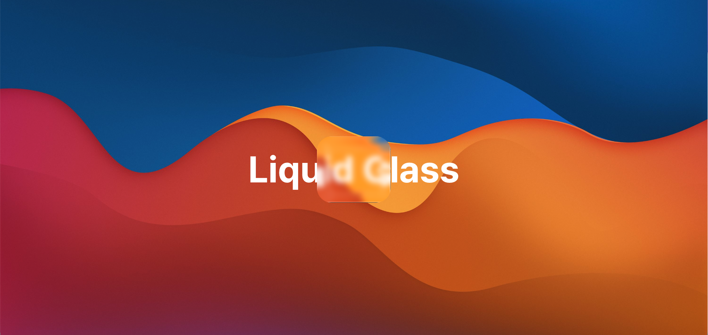

# @yoy0z-maps/liquid-glass-react

A lightweight React component that recreates a **liquid glass / distorted edge** card using pure CSS + SVG filters.  
You can freely control layout, motion, and drag — this component only focuses on the visual effect.

> ⚠️ Uses SVG filters (`feTurbulence`, `feDisplacementMap`) — best viewed in Chromium-based browsers.

---

## 🚀 Installation

```bash
npm install @yoy0z-maps/liquid-glass-react
# or
yarn add @yoy0z-maps/liquid-glass-react
# or
pnpm add @yoy0z-maps/liquid-glass-react
```

Import the CSS once globally (e.g., in \_app.tsx or layout.tsx):

```tsx
import "@yoy0z-maps/liquid-glass-react/index.css"; // Required: imports default LiquidGlass styles
```

---

## 🎨 Demo Preview

<p align="center">
  
</p>

### 🧪 Live Playground

👉 [Live Playground](https://yoy0z-maps.com/npm/liquid-glass)

---

## 💧 Basic Usage

```tsx
"use client";

import React from "react";
import { LiquidGlass } from "@yoy0z-maps/liquid-glass-react";
import "@yoy0z-maps/liquid-glass-react/index.css"; // Required: imports default LiquidGlass styles

export default function Page() {
  return (
    <div
      style={{
        height: "100vh",
        display: "flex",
        justifyContent: "center",
        alignItems: "center",
        backgroundImage: 'url("/assets/liquid-bg.jpg")',
        backgroundSize: "cover",
        backgroundPosition: "center",
      }}
    >
      <LiquidGlass width={260} height={220}>
        <div
          style={{
            display: "flex",
            flexDirection: "column",
            alignItems: "center",
            gap: "8px",
            color: "white",
          }}
        >
          <h1 style={{ fontSize: "1.25rem", fontWeight: 600 }}>Liquid Glass</h1>
          <p style={{ fontSize: "0.9rem", opacity: 0.8 }}>
            Content rendered inside the glass panel.
          </p>
        </div>
      </LiquidGlass>
    </div>
  );
}
```

### 🎨 Tailwind Example

You can fully customize the inner layout using innerClassName or innerStyle.

```tsx
<LiquidGlass
  width={320}
  height={240}
  borderRadius={32}
  innerClassName="flex flex-col items-center justify-center gap-4"
>
  <p className="text-white text-lg font-semibold">Liquid Glass</p>
  <span className="text-white/70 text-sm">Tailwind inside the panel</span>
</LiquidGlass>
```

### 🌀 Optional: Make It Draggable

Drag the panel to fully appreciate the liquid glass effect. This react-liquid-glass doesn’t handle drag natively — but you can wrap it with gesture libs. Here's a example code.

```tsx
"use client";

import { useRef, useState } from "react";

import { LiquidGlass } from "react-liquid-glass";
import "react-liquid-glass/index.css";

export default function Page() {
  const [pos, setPos] = useState({ x: 0, y: 0 });
  const draggingRef = useRef(false);
  const startRef = useRef({ x: 0, y: 0 });

  const onMouseDown: React.MouseEventHandler<HTMLDivElement> = (e) => {
    draggingRef.current = true;
    startRef.current = {
      x: e.clientX - pos.x,
      y: e.clientY - pos.y,
    };
  };

  const onMouseMove: React.MouseEventHandler<HTMLDivElement> = (e) => {
    if (!draggingRef.current) return;
    setPos({
      x: e.clientX - startRef.current.x,
      y: e.clientY - startRef.current.y,
    });
  };

  const stopDrag = () => {
    draggingRef.current = false;
  };

  return (
    <div
      onMouseMove={onMouseMove}
      onMouseUp={stopDrag}
      onMouseLeave={stopDrag}
      style={{
        height: "100vh",
        display: "flex",
        justifyContent: "center",
        alignItems: "center",
        backgroundImage: 'url("/assets/images.jpg")',
        backgroundSize: "cover",
        backgroundPosition: "center",
        backgroundRepeat: "no-repeat",
      }}
    >
      <p className="absolute left-1/2 top-1/2 -translate-x-1/2 -translate-y-1/2 text-[100px] font-bold text-white">
        Liquid Glass
      </p>
      <div
        onMouseDown={onMouseDown}
        style={{
          transform: `translate(${pos.x}px, ${pos.y}px)`,
          cursor: "grab",
        }}
      >
        <LiquidGlass width={200} height={180} style={{ borderRadius: "0px" }}>
          <div className="flex h-full items-center justify-center">
            <p className="text-neutral-200">Hello World</p>
          </div>
        </LiquidGlass>
      </div>
    </div>
  );
}
```

---

## ⚙️ Props

```tsx
export interface LiquidGlassProps {
  width?: number;
  height?: number;
  borderRadius?: number | string;
  className?: string;
  style?: React.CSSProperties;
  innerClassName?: string;
  innerStyle?: React.CSSProperties;
  children?: React.ReactNode;
}
```

| Prop             | Type                  | Default | Description                                  |
| ---------------- | --------------------- | ------- | -------------------------------------------- |
| `width`          | `number`              | `420`   | Card width (auto-clamped to `90vw`)          |
| `height`         | `number`              | `420`   | Card height (auto-clamped to `90vw`)         |
| `borderRadius`   | `number \| string`    | `40`    | Border radius for outer glass                |
| `className`      | `string`              | —       | Extra class for wrapper div                  |
| `style`          | `React.CSSProperties` | —       | Inline styles for wrapper div                |
| `innerClassName` | `string`              | —       | Class for the inner content area             |
| `innerStyle`     | `React.CSSProperties` | —       | Inline styles for the inner content area     |
| `children`       | `React.ReactNode`     | —       | Anything you want to render inside the glass |

---

## 🧠 Notes

    •	The component injects its SVG filter chain (feTurbulence + feDisplacementMap) once per document.
    •	The glass edges are four filtered <div> strips that distort the background.
    •	The center panel uses backdrop-filter: blur() for the translucent glass look.
    •	It’s pure CSS/SVG – no WebGL, no canvas, so it’s lightweight but still visually dynamic.

### 🧩 Browser Support

| Browser       | Support    | Notes                                             |
| ------------- | ---------- | ------------------------------------------------- |
| Chrome / Edge | ✅ Full    | Best rendering                                    |
| Safari        | ⚠️ Partial | `backdrop-filter` OK, minor SVG blur difference   |
| Firefox       | ⚠️ Partial | Needs `layout.css.backdrop-filter.enabled = true` |
